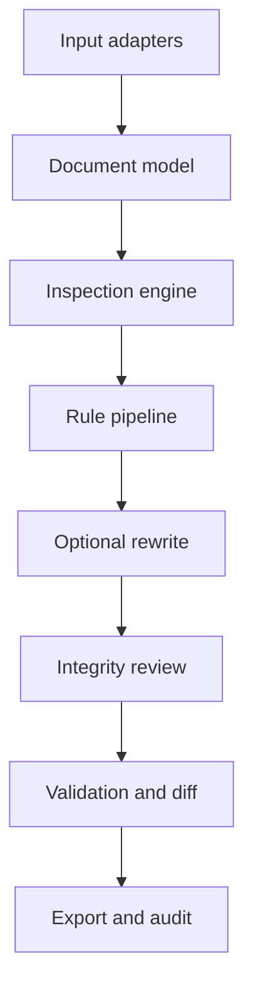

# Text Integrity Studio

## Complete behavioural and developer specification

**Status:** Phases 0 to 5 implemented; Phase 6 v0.8.0 release candidate implemented; v1.0.0 pending signed builds and cross-platform acceptance approval  
**Specification version:** 1.1  
**Date:** 4 September 2026

## Executive summary

Text Integrity Studio is a local-first application for inspecting, explaining, cleaning, normalising and optionally refining text. It combines the strongest observable ideas from AI Text Cleaner, LLM Pulse AI Watermark Remover, Originality.ai Invisible Text Detector, mature Unicode libraries such as ICU and ftfy, and the factual-preservation approach of the highly starred `blader/humanizer` project.

The product does not claim that ordinary Unicode characters prove AI authorship or that deleting them makes text undetectable. It distinguishes verifiable character-level findings from statistical authorship signals. Its core promise is text integrity: the user can see what is present, understand why it may matter, choose what to change and verify that meaning and structure were preserved.

The minimum viable product is an offline desktop and command-line tool that accepts plain text, reports suspicious or unusual Unicode characters, applies selectable deterministic cleaning rules, presents a reversible difference view and exports cleaned text plus an optional audit report. Rewriting is a later, separately enabled module. A later Pre-submission Integrity Review module may help users improve attribution, citation quality and originality, but it must not claim to reproduce, predict or evade Turnitin or any other proprietary detector.

---

## 1. Functional decomposition

### 1.1 Essential subsystems

#### Input and document ingestion

Accept pasted text, UTF-8 `.txt` and `.md` files in the MVP. Detect byte-order marks, encoding failures, newline style, file size and likely binary input. Later adapters may accept DOCX, PDF, HTML and clipboard input.

#### Text inventory

Create an immutable inventory of every Unicode code point, grapheme cluster, line boundary and structural region. Record source offsets before any transformation so findings can be mapped back to the original input.

#### Unicode inspection

Classify characters into safe, contextual, suspicious and prohibited categories. Report code point, Unicode name, general category, script, display representation, source position, surrounding context and proposed action.

#### Hidden-payload inspection

Detect runs of tag characters, variation selectors, zero-width encodings, bidirectional controls and other format characters. Attempt decoding only when a documented encoding pattern is recognised. A failed decoding attempt must not be presented as proof of a payload.

#### Deterministic cleaning

Apply independent, configurable rules for invisible controls, whitespace, punctuation, Markdown residue, encoding repair, Unicode normalisation and optional confusable replacement.

#### Structural preservation

Protect paragraphs, headings, lists, tables, code spans, fenced code blocks, URLs, email addresses, citations and user-defined protected regions.

#### Difference and audit engine

Show insertions, deletions and replacements at character, word and line level. Every change must name the responsible rule and support undo.

#### Validation

Confirm output encoding, valid Unicode, preserved protected regions, idempotence of deterministic profiles and absence of unintended data loss.

#### Output

Copy to clipboard, save cleaned text and export a JSON or Markdown processing report. Preserve original newline style when requested.

#### User interface and profiles

Provide Safe, Publishing, Developer and Custom profiles. Destructive rules must be off by default and labelled clearly.

### 1.2 Optional subsystems

- Meaning-preserving rewriting and style refinement
- Local model management
- DOCX, HTML and PDF adapters
- Batch processing
- REST API and browser extension
- Project history and reusable user profiles
- Organisation policies and signed audit reports
- Pre-submission citation, attribution and similarity-risk review

---

## 2. Reverse-engineered behaviour specification

### 2.1 Primary observed benchmark

AI Text Cleaner accepts pasted plain text and offers ten toggles: remove hidden characters, convert non-breaking spaces, normalise dashes, normalise quotes, convert ellipsis, remove trailing whitespace, remove asterisks, remove Markdown headings, convert lookalike characters and apply NFKC normalisation.

The first six rules are enabled by default. Cleaning produces an output panel, a copy action, a change view and category-level statistics. The Clean button is disabled for empty input. Preferences persist across reloads.

### 2.2 Verified transformations

| Input | Enabled rule | Expected output |
|---|---|---|
| `A\u200BB` | Remove hidden characters | `AB` |
| `A\u00A0B` | Convert non-breaking spaces | `A B` |
| `word—word` | Normalise dashes | `word-word` |
| `“text”` | Normalise quotes | `"text"` |
| `wait…` | Convert ellipsis | `wait...` |
| `line  \n` | Remove trailing whitespace | `line\n` |
| `*bold*` | Remove asterisks | `bold` |
| `## Heading` | Remove Markdown headings | `Heading` |
| Cyrillic `а` in Latin context | Convert lookalikes | Latin `a` |
| `fi Ｈｅｌｌｏ` | NFKC | `fi Hello` |

### 2.3 Behaviour to reproduce confidently

- Independent cleaning toggles
- Conservative defaults
- Side-by-side input and output
- Change statistics by rule
- Copy and reset actions
- Local preference persistence
- Plain-text processing without mandatory sign-in

### 2.4 Behaviour requiring further black-box testing

- Exact list of characters removed by “hidden characters”
- Transformation order when rules interact
- Handling of CRLF, CR and mixed line endings
- Maximum practical input length
- Grapheme-cluster safety for emoji and combining marks
- Treatment of bidirectional controls and Arabic or Indic joiners
- Exact confusable mapping table
- Whether Markdown removal protects code fences
- Idempotence under every rule combination
- Error handling for malformed surrogate pairs

### 2.5 Failure and warning behaviour for the new product

| Condition | Required behaviour |
|---|---|
| Empty input | Disable processing and show no error |
| Invalid file encoding | Offer detected alternatives without silently replacing bytes |
| Binary file | Reject with a clear unsupported-input message |
| File above configured limit | Warn and offer streaming CLI processing |
| Contextual characters detected | Flag, explain and preserve by default |
| Destructive rule selected | Show warning and affected-character preview |
| Local model unavailable | Keep deterministic tools operational |
| Rewrite validation fails | Return original text and explain the failed check |

---

## 3. Text and Unicode analysis model

### 3.1 Classification

Each finding has one of four recommended actions.

#### Remove by default

Characters with no legitimate role in ordinary prose and strong potential for hidden payloads or parsing problems, including Unicode tag-character payload runs, noncharacters, isolated byte-order marks inside text and disallowed C0/C1 controls other than tab and recognised line endings.

#### Normalise by default

Non-breaking and unusual spaces in ordinary Latin prose when the selected profile permits it, trailing horizontal whitespace and inconsistent line endings. Transformations must remain visible in the audit.

#### Preserve and flag

Bidirectional controls, zero-width joiners and non-joiners, single variation selectors, combining marks, soft hyphens, mixed scripts and unusual spaces. These have legitimate linguistic or typographic functions.

#### Preserve silently

Ordinary letters, numbers, punctuation, required combining sequences and well-formed emoji sequences.

### 3.2 Character families

| Family | Examples | Default treatment |
|---|---|---|
| Zero-width | U+200B, U+2060, U+FEFF | Flag; remove U+200B and interior BOM in Safe Latin profile |
| Join controls | U+200C, U+200D | Preserve and flag contextually |
| Bidi controls | U+202A–U+202E, U+2066–U+2069 | Flag prominently; never silently delete in multilingual text |
| Variation selectors | U+FE00–U+FE0F, supplementary selectors | Preserve single valid selectors; inspect suspicious runs |
| Spaces | NBSP, NNBSP, thin, hair, em and ideographic spaces | Context-dependent replacement |
| Soft hyphen | U+00AD | Flag; optional removal |
| Combining marks | Mn, Mc, Me categories | Preserve; report abnormal or orphaned sequences |
| Confusables | Cyrillic `а`, Greek `ο` in Latin text | Flag mixed-script risk; replacement off by default |
| Punctuation | Smart quotes, en/em dashes, ellipsis | Optional profile-driven normalisation |
| Tags and payload carriers | U+E0000 block | Decode when valid, then remove only with explicit audit |
| Replacement character | U+FFFD | Flag as evidence of prior decoding loss |

### 3.3 Normalisation policy

NFC is the safe default for general prose. NFKC is opt-in because it can collapse distinctions such as ligatures, mathematical alphabets, width variants and compatibility symbols. The UI must preview affected characters before applying NFKC.

### 3.4 Multilingual safety

Script detection must operate on spans, not single characters alone. A Latin paragraph containing one Cyrillic lookalike is suspicious, but Arabic join controls in Arabic text are expected. The engine must use Unicode Script and Script_Extensions properties, language hints and neighbouring grapheme clusters.

---

## 4. Algorithms and processing pipeline

### 4.1 Required order

1. Decode input bytes without loss.
2. Snapshot the original text and structure.
3. Segment grapheme clusters and protected regions.
4. Inventory code points and scripts.
5. Detect controls, suspicious runs and possible payloads.
6. Produce a pre-clean inspection report.
7. Apply encoding repair when explicitly enabled.
8. Apply Unicode normalisation.
9. Apply whitespace rules.
10. Apply punctuation rules.
11. Apply optional Markdown and confusable rules.
12. Reconstruct protected structure.
13. Optionally rewrite prose in a separate pipeline.
14. Validate and compare.
15. Generate output and audit report.

### 4.2 Invisible-character detection

**Objective:** Find nonprinting, format and suspicious characters without assuming malicious intent.

**Pseudocode:**

```text
for each grapheme cluster in text:
    for each code point in cluster:
        properties = unicode_database.lookup(code_point)
        context = surrounding_script_and_structure(cluster)
        classification = policy.classify(properties, context)
        if classification is reportable:
            emit Finding(position, code_point, properties, context, action)
group adjacent compatible findings into runs
attempt payload decoding only for recognised run types
```

Complexity is O(n) time and O(k) findings, where n is the number of code points and k is the number of reported findings.

### 4.3 Suspicious payload decoding

Decode tag characters by mapping their documented tag values. Decode variation-selector or zero-width sequences only when the sequence matches a configured codec and yields valid printable UTF-8. Label the result “possible decoded payload,” never “confirmed watermark.”

### 4.4 Safe cleaning

```text
output = original
for rule in ordered_enabled_rules:
    for candidate in rule.find(output, protected_regions):
        if candidate.is_contextually_safe or user_approved(candidate):
            output, edit = rule.apply(output, candidate)
            audit.append(edit)
validate(output, audit, protected_regions)
```

Rules must be pure, deterministic and individually testable. Every edit records source range, output range, old text, new text, rule ID, severity and explanation.

### 4.5 Structural preservation

Parse Markdown into protected and editable spans. Never rewrite code fences, inline code, URLs, citation keys, YAML front matter or HTML attributes unless a specific developer profile enables it. For plain text, preserve paragraph boundaries and newline count by default.

### 4.6 Validation

- UTF-8 round-trip succeeds
- No unpaired surrogate remains
- Protected spans match their original hashes
- Deterministic cleaning is idempotent
- Audit replay reproduces output
- Audit reversal reproduces input
- Counts equal the number of recorded edits
- Optional semantic similarity and entity checks pass after rewriting

---

## 5. Paraphrasing and humanisation architecture

### 5.1 Product boundary

The rewrite module improves clarity, naturalness and stylistic fit. It must not promise detector evasion, plagiarism avoidance or false claims of human authorship.

### 5.2 Approaches

| Approach | Quality | Privacy | Hardware | Reproducibility | Recommendation |
|---|---|---|---|---|---|
| Deterministic rules | Moderate for surface edits | Excellent | Minimal | Excellent | Required baseline |
| Synonym substitution | Often poor and meaning-risky | Excellent | Minimal | Excellent | Avoid as a primary method |
| Local NLP pipeline | Moderate | Excellent | Low | High | Use for diagnostics |
| Local transformer | High with suitable model | Excellent | Medium to high | Medium | Optional local rewrite |
| Configurable remote LLM | Potentially high | Depends on provider | Low locally | Medium | Off by default |
| Hybrid | Highest controllability | Configurable | Variable | Good | Recommended final architecture |

### 5.3 Two-pass rewrite

Pass one restructures prose while preserving claims. Pass two audits the draft for artificial patterns, excessive formality, repetitive openings, unsupported claims, sales language, filler, forced lists, generic conclusions and punctuation habits.

Before accepting a rewrite, extract and compare:

- Named entities
- Dates and times
- Numbers and units
- Quotations
- URLs and citation keys
- Negations and modal verbs
- Domain terminology

Any unexplained loss, addition or polarity change blocks automatic acceptance.

### 5.4 Voice matching

Allow the user to provide a writing sample. Derive non-sensitive style features such as average sentence length, contraction use, paragraph length, punctuation distribution and preferred level of formality. Do not train on, upload or retain the sample unless explicitly requested.

### 5.5 Pre-submission Integrity Review

#### Purpose and product boundary

The module helps authors identify missing attribution, citation inconsistencies, accidental reuse and potentially confusing writing before formal submission. It is an integrity and quality-assurance feature, not a detector-evasion system.

The module must never:

- Promise a zero or reduced Turnitin Similarity score
- Promise a zero or reduced AI-writing score
- Describe its output as a Turnitin report or equivalent result
- Optimise wording against a proprietary detector
- Recommend hidden characters, homoglyphs, encoding corruption or structural manipulation
- Remove legitimate citations or quotations merely to reduce matching text
- Present automated paraphrasing as proof of human authorship

Product language must state:

> Text Integrity Studio improves attribution, originality, transparency, citation quality and document integrity. It does not predict or guarantee results from Turnitin or another proprietary service.

#### Turnitin-informed, non-proprietary concepts

Public documentation establishes that a Turnitin Similarity Report compares submission text against configured repositories and reports matched text. It is not itself a plagiarism judgment. Quotation, bibliography, template, source and small-match exclusions may affect how a reviewer interprets the report. Turnitin's AI-writing indicator is a separate proprietary statistical system and must not be treated as equivalent to Unicode inspection.

Text Integrity Studio may adopt general report-design concepts that are not proprietary implementations:

- Passage-level highlighting
- Match grouping and category summaries
- Explainable filters and exclusions
- Separate evidence from conclusions
- Reviewer-controlled acceptance and dismissal
- Exportable audit evidence

#### Functional scope

The Pre-submission Integrity Review module should provide:

1. **Citation inventory:** Extract in-text citations, footnotes, endnotes and bibliography entries.
2. **Citation reconciliation:** Flag citations without references and references never cited in the text.
3. **Quotation review:** Identify quoted passages without nearby attribution and citations that may not cover the quoted material.
4. **Attribution review:** Flag long or distinctive passages lacking a citation without alleging plagiarism.
5. **User-corpus comparison:** Compare a draft only against documents deliberately supplied by the user to identify accidental self-overlap.
6. **Optional public-source search:** Search selected phrases on the public web only after explicit opt-in, with clear privacy disclosure and rate limits.
7. **Legitimate exclusions:** Let users classify bibliography, quotations, methods, templates, legal text and common technical language without deleting them.
8. **Scientific integrity validation:** Protect numbers, units, equations, entities, quotations, URLs, accession numbers and citation keys during any revision.
9. **Authorship transparency:** Support an optional statement describing permitted AI assistance and the author's verification steps.
10. **Revision audit:** Record user decisions, accepted edits, dismissed warnings and evidence sources without silently changing the document.

#### Results and terminology

The module may report local metrics such as:

- Percentage of text covered by citations
- Number of unmatched citations and references
- Number and length of passages matching the user-supplied corpus
- Number of quotations without nearby attribution
- Number of reviewed, dismissed and unresolved findings

These must be labelled local integrity metrics. Do not call them a plagiarism percentage, AI percentage, Turnitin score or predicted similarity score. There is no universal acceptable similarity threshold, and a zero similarity value is not a quality objective.

#### Controlled research policy

Controlled evaluation may use documents the user owns or is authorised to test. Permitted research questions include report stability, false positives, citation handling, legitimate exclusions and preservation of scientific content. Testing designed to discover transformations that bypass or suppress proprietary detection is outside product scope.

#### Failure and warning behaviour

| Condition | Required behaviour |
|---|---|
| No comparison corpus or source access | Run citation-only review and explain the limitation |
| Public-source search disabled | Make no network request |
| Citation style cannot be identified | Ask the user to select a style or continue with generic parsing |
| A possible unattributed match is found | Show evidence and request review; do not label it plagiarism |
| Revision changes a protected fact | Block automatic acceptance and show the conflict |
| User requests detector evasion | Decline the operation and offer integrity-focused revision |
| External service result differs | Explain that local metrics are not predictions of proprietary systems |

---

## 6. Technical architecture

### 6.1 Recommended form

Build a shared Python core with a CLI first, then a Tauri desktop shell using a React and TypeScript interface. The CLI makes algorithms testable and automatable. Tauri provides a smaller and more security-controlled desktop package than Electron. A local web preview may be used during development but should not be the primary privacy boundary.

### 6.2 Layers



### 6.3 Major modules

- `ingest`: decoding, file limits and format adapters
- `document`: immutable text, spans, offsets and structure
- `unicode`: properties, scripts, graphemes and normalisation
- `inspect`: findings, severity and payload detection
- `rules`: pure cleaning transformations
- `profiles`: safe rule collections and user settings
- `protect`: Markdown, code, URL and citation protection
- `rewrite`: backends, prompts and deterministic style rules
- `citations`: citation and bibliography extraction and reconciliation
- `integrity`: attribution, quotation and user-corpus comparison findings
- `sources`: explicit opt-in public-source lookup adapters
- `validate`: invariants, entity checks and semantic checks
- `diff`: reversible edit model and visual annotations
- `report`: JSON, Markdown and human-readable reports
- `cli`: commands and streaming batch operation
- `desktop`: Tauri bridge and React interface

### 6.4 Core interfaces

```text
Inspector.inspect(Document, InspectionPolicy) -> InspectionReport
Rule.preview(Document, Context) -> list[CandidateEdit]
Rule.apply(Document, CandidateEdit) -> AppliedEdit
Pipeline.run(Document, Profile) -> ProcessingResult
Rewriter.rewrite(ProseSpan, RewriteConfig) -> RewriteCandidate
IntegrityReviewer.review(Document, ReviewPolicy) -> IntegrityReport
CorpusMatcher.compare(Document, AuthorisedCorpus) -> list[IntegrityFinding]
Validator.validate(Source, Candidate, Policy) -> ValidationReport
Exporter.export(ProcessingResult, Format) -> bytes
```

### 6.5 Persistence

Use a local settings file for profiles and UI preferences. Do not retain source text by default. Optional project history must use explicit opt-in and local encryption where available.

---

## 7. Technology selection

### 7.1 Recommended stack

- Python 3.12 or newer for the core engine and CLI
- `unicodedata` plus generated Unicode Character Database tables
- `regex` for grapheme-aware regular expressions
- `ftfy` for conservative encoding repair
- `pydantic` for validated models and configuration
- `Typer` for the CLI
- `pytest`, Hypothesis and mutation testing for quality
- `structlog` or standard structured logging with content redaction
- React and TypeScript for the interface
- Tauri 2 for desktop packaging
- Optional ONNX Runtime or llama.cpp-compatible backend for local rewriting

### 7.2 Rationale

Python has the strongest practical ecosystem for text processing and local NLP. Rust is attractive for a later high-performance core, but beginning there would slow behavioural iteration. Tauri is preferred to Electron for smaller installers, reduced memory use and a narrower desktop bridge. Streamlit and Gradio are excellent prototypes but weaker choices for a polished, offline desktop product.

### 7.3 Dependency policy

Pin dependencies, generate a software bill of materials, scan licences and vulnerabilities, and record Unicode data versions. `ftfy` requires Apache-licence attribution. ICU and ICU4X use Unicode licensing terms. `blader/humanizer` uses MIT but should initially serve as a behavioural and design reference rather than copied production logic.

---

## 8. Repository and project structure

```text
text-integrity-studio/
├── README.md
├── LICENSE
├── CHANGELOG.md
├── SECURITY.md
├── CONTRIBUTING.md
├── pyproject.toml
├── src/text_integrity/
│   ├── ingest/
│   ├── document/
│   ├── unicode/
│   ├── inspect/
│   ├── rules/
│   ├── profiles/
│   ├── protect/
│   ├── rewrite/
│   ├── validate/
│   ├── diff/
│   ├── report/
│   └── cli/
├── desktop/
│   ├── src/
│   └── src-tauri/
├── models/
│   └── README.md
├── config/
├── tests/
│   ├── unit/
│   ├── integration/
│   ├── regression/
│   ├── property/
│   └── fixtures/
├── benchmarks/
├── corpus/
│   ├── inputs/
│   └── expected/
├── examples/
├── docs/
│   ├── architecture/
│   ├── unicode-policy/
│   ├── privacy/
│   └── user-guide/
├── scripts/
└── .github/
    ├── workflows/
    └── ISSUE_TEMPLATE/
```

Generated Unicode tables must record their source version and generation script. Model files should not be committed unless their licences and size make distribution appropriate.

---

## 9. Testing and validation framework

### 9.1 Test layers

- Unit tests for each classifier and rule
- Property-based tests across arbitrary Unicode strings
- Integration tests for complete profiles
- Golden regression tests for known examples
- Cross-platform CLI tests
- Desktop end-to-end tests
- Performance and memory benchmarks
- Offline-operation tests with network access blocked
- Security tests for bidi controls, hidden prompts and malformed files
- Citation parsing and bibliography reconciliation tests
- Authorised-corpus passage matching tests
- Tests proving exclusions do not delete document content
- Tests proving public-source search is off by default
- Tests rejecting detector-evasion operations

### 9.2 Behavioural-equivalence harness

Store a corpus entry as:

```json
{
  "case_id": "dash_quote_001",
  "input": "“Hello”—world…",
  "options": ["normalize_quotes", "normalize_dashes", "convert_ellipsis"],
  "reference_output": "\"Hello\"-world...",
  "source": "ai-text-cleaner-observed",
  "observed_at": "2026-09-04",
  "confidence": "verified"
}
```

Run the same corpus through the reference interface and local implementation. Compare exact output for deterministic rules, per-category counts, preserved line endings and idempotence. Store uncertain observations separately from acceptance tests.

### 9.3 Acceptance criteria

- 100% exact match on verified deterministic benchmark cases
- 100% pass on protected-region invariants
- 100% reversible deterministic audit log
- Zero silent changes to contextual characters in Safe profile
- Idempotence for every deterministic profile
- At least 99% branch coverage in character classification
- Process 1 million code points in under two seconds on a reference laptop for inspection-only mode
- Peak memory below three times input size for ordinary files
- No network request during offline mode
- Rewrite mode preserves all protected entities in the acceptance corpus
- Integrity findings include evidence and avoid plagiarism verdicts
- Local metrics are never labelled as Turnitin or AI-detection scores
- Citation-only review functions without a network connection
- Public-source lookup requires explicit opt-in for each project

### 9.4 Multilingual corpus

Include English, German, French, Arabic, Hebrew, Hindi, Bengali, Tamil, Thai, Chinese, Japanese, Korean, Greek, Cyrillic languages and emoji-rich text. Cases must contain legitimate joiners, combining marks, bidirectional text and mixed-script brand names.

---

## 10. Local execution and packaging

### 10.1 CLI

```text
text-integrity inspect input.txt
text-integrity clean input.md --profile safe --output cleaned.md
text-integrity clean folder/ --recursive --report report.json
text-integrity rewrite input.txt --backend local --style concise
```

### 10.2 Development installation

Use `uv` or a Python virtual environment for the core. Node and Rust toolchains are required only for desktop development. Lock Python and JavaScript dependencies.

### 10.3 Standalone delivery

- Windows: signed MSI or installer executable
- macOS: signed and notarised DMG
- Linux: AppImage plus optional `.deb`
- CLI: PyPI package and optional standalone binary

The desktop application must run deterministic inspection and cleaning without Python separately installed. Package the core through an embedded service or compile it with an appropriate bundler after prototype stabilisation.

### 10.4 Updates

Updates must be signed, optional and transparent. The application must remain functional without an update connection. Model downloads require explicit approval, size display, licence display and checksum verification.

---

## 11. GitHub publishing strategy

The README should begin with the product’s factual purpose and a warning that Unicode inspection does not determine authorship. Include screenshots, a five-minute quick start, supported profiles, privacy guarantees, limitations and contribution instructions.

Use semantic versioning, a Keep a Changelog format and signed release artefacts. GitHub Actions should run linting, unit tests, property tests, licence checks, dependency scans and builds for Windows, macOS and Linux.

Recommended issue templates:

- Incorrect character classification
- Unintended text change
- Multilingual problem
- File-format problem
- Security report through private disclosure
- Feature request

Choose a permissive licence only after completing a dependency audit. Apache-2.0 is a strong candidate because it includes an explicit patent grant. MIT is simpler but offers less patent language.

---

## 12. Privacy, security and local-first design

### 12.1 Defaults

- No account
- No telemetry
- No advertisements
- No content logging
- No automatic cloud rewrite
- No automatic clipboard monitoring
- No persistence of source text
- No model download without approval

### 12.2 Logging

Logs may contain rule IDs, counts, durations, versions and error codes. They must never contain source text, excerpts, file paths or decoded hidden payloads unless the user explicitly creates a diagnostic package and reviews it.

### 12.3 Temporary files

Prefer in-memory processing. When temporary files are required, use OS-provided private temporary directories, restrictive permissions and guaranteed cleanup. Crash recovery must not expose document content.

### 12.4 Threat model

Consider hidden prompt injection, path traversal in archives, decompression bombs, malicious DOCX or PDF content, bidi spoofing, confusable filenames, model-supply-chain risks and unsafe Tauri bridge commands. Document parsing must run with strict size limits and no macro execution.

---

## 13. Optional future enhancements

| Feature | User value | Complexity | Priority |
|---|---:|---:|---:|
| Side-by-side diff and Unicode visualisation | Very high | Medium | MVP |
| Configurable cleaning profiles | Very high | Low | MVP |
| Batch TXT and Markdown | High | Medium | Phase 2 |
| DOCX preservation | High | High | Phase 3 |
| HTML import and export | High | Medium | Phase 3 |
| Local rewrite model | High | High | Phase 4 |
| Multilingual rewrite packs | High | High | Phase 5 |
| PDF extraction | Medium | High | Phase 5 |
| REST API | Medium | Medium | Phase 4 |
| Browser extension | Medium | Medium | Phase 5 |
| VS Code extension | Medium | Medium | Phase 5 |
| Plugin architecture | Medium | High | Phase 6 |
| Signed compliance reports | Medium | High | Phase 6 |

PDF editing should remain out of scope until layout-preserving reconstruction is validated. Extracted PDF text can be inspected earlier, but exporting it as a faithful cleaned PDF is a separate product problem.

---

## 14. Development roadmap

### Phase 0: Behaviour corpus

**Objective:** Convert observations into executable evidence.  
**Tasks:** Expand black-box cases, classify confidence and document unknowns.  
**Deliverables:** Versioned corpus and reference results.  
**Validation:** Repeated reference runs produce stable outputs.  
**Dependencies:** Public benchmark access.  
**Risks:** Reference behaviour may change without notice.

### Phase 1: Inspection CLI

**Objective:** Build a scientifically defensible Unicode inspector.  
**Tasks:** Document model, grapheme segmentation, character inventory, contextual classification and reports.  
**Deliverables:** `inspect` CLI and JSON schema.  
**Validation:** Unicode and property-based test suite passes.  
**Dependencies:** Unicode data and Python core.  
**Risks:** False positives in multilingual text.

### Phase 2: Deterministic cleaning MVP

**Objective:** Reproduce verified cleaning behaviour safely.  
**Tasks:** Pure rules, profiles, protected spans, audit log and reversible edits.  
**Deliverables:** `clean` CLI for TXT and Markdown.  
**Validation:** Exact benchmark equivalence and idempotence.  
**Dependencies:** Phase 1.  
**Risks:** Interacting rules and offset drift.

### Phase 3: Desktop application

**Objective:** Make inspection and selective cleaning accessible.  
**Tasks:** React interface, Tauri bridge, character explorer, diff, settings and export.  
**Deliverables:** Alpha installers for three operating systems.  
**Validation:** End-to-end tests and offline network audit.  
**Dependencies:** Stable core API.  
**Risks:** Packaging and signing complexity.

### Phase 4: Rewrite module

**Objective:** Add optional meaning-preserving refinement.  
**Tasks:** Deterministic style audit, backend interface, local model option and entity validation.  
**Deliverables:** Rewrite preview with acceptance controls.  
**Validation:** No protected-fact regressions in the rewrite corpus.  
**Dependencies:** Diff and validation engine.  
**Risks:** Hallucination, tone drift and hardware variability.

### Phase 4A: Pre-submission Integrity Review

**Objective:** Help authors improve attribution, citation consistency and originality without predicting or evading proprietary detectors.  
**Tasks:** Citation inventory, bibliography reconciliation, quotation review, authorised-corpus comparison, evidence-based findings, exclusions and revision audit.  
**Deliverables:** Local integrity report, passage review interface and JSON or Markdown export.  
**Validation:** Citation fixtures pass; protected facts remain unchanged; offline mode makes no network requests; detector-evasion requests are rejected.  
**Dependencies:** Stable document model, protected spans, diff engine and user-approved corpus ingestion.  
**Risks:** False attribution warnings, citation-style ambiguity, privacy exposure in optional public searches and misleading comparison with commercial reports.

### Phase 5: Document and multilingual expansion

**Objective:** Support real workflows beyond plain text.  
**Tasks:** DOCX and HTML adapters, expanded language rules, batch processing and optional PDF extraction.  
**Deliverables:** Beta release.  
**Validation:** Formatting and multilingual preservation suites.  
**Dependencies:** Mature core and desktop application.  
**Risks:** Format-specific data loss.

### Phase 6: Public release

**Objective:** Publish a secure, maintainable open-source product.  
**Tasks:** Security review, licence audit, SBOM, signed builds, documentation and contributor workflows.  
**Deliverables:** Version 1.0.0.  
**Validation:** Reproducible builds, clean security scan and acceptance-test completion.  
**Dependencies:** All release-blocking defects resolved.  
**Risks:** Long-term model and dependency maintenance.  
**Implementation status:** Version 0.8.0 provides the release-readiness verifier, automated Bandit and dependency audits, CycloneDX SBOM generation, MIT and third-party licensing records, security and user documentation, Dependabot, pull-request checks, acceptance-test procedures and checksummed Windows, macOS and Linux release-candidate builds. Version 1.0.0 remains blocked until platform signing is configured, cross-platform acceptance evidence is approved and every release-blocking defect is closed.

---

## 15. Final consolidated developer specification

### Purpose

Build a trustworthy local application that reveals and explains non-obvious text features, performs reversible Unicode and formatting cleanup, optionally improves prose without changing facts and supports evidence-based pre-submission integrity review.

### MVP

An offline Python CLI and Tauri desktop interface supporting pasted text, TXT and Markdown; Unicode inspection; safe profiles; selectable transformations; side-by-side differences; undo; and JSON or Markdown audit reports.

### Core architecture

Use an immutable document model, contextual Unicode inspector, ordered pure-rule pipeline, protected structural spans, reversible edit log and independent validation layer. Keep deterministic cleaning entirely separate from model-based rewriting.

### Processing pipeline

Decode, snapshot, segment, inspect, report, repair encoding if enabled, normalise Unicode, normalise whitespace and punctuation, apply optional structural rules, rewrite only when requested, run citation and attribution review when requested, validate, diff and export.

### Technology

Python core, Typer CLI, Unicode data plus `regex` and `ftfy`, Pydantic models, pytest and Hypothesis testing, React and TypeScript UI, and Tauri desktop packaging. Add ONNX Runtime or a llama.cpp-compatible backend only in the rewrite phase.

### Repository

Use a modular monorepo separating core algorithms, desktop code, models, corpus, tests, benchmarks, documentation and release automation.

### Testing

Require exact behavioural-equivalence tests for verified deterministic transformations, property-based Unicode tests, multilingual corpora, reversible audit logs, idempotence, protected-span hashes, performance benchmarks and network-blocked offline tests.

### Deployment

Publish signed Windows, macOS and Linux installers plus a Python CLI. Updates and model downloads remain optional and verified.

### What can be reproduced confidently

- The observed ten-toggle cleaning interface
- Default rule configuration
- Verified punctuation, whitespace, hidden-character, Markdown, confusable and NFKC transformations
- Change statistics, copy, reset and comparison behaviour
- Local-first, no-account workflow

### What remains uncertain

- Complete proprietary character lists
- Exact internal transformation ordering
- Edge-case handling across all scripts
- Performance limits
- Statistical watermark behaviour
- Undocumented failure messages

### What needs additional testing

- Every relevant Unicode category
- Joiners, variation selectors and emoji sequences
- Bidirectional and mixed-script content
- Protected Markdown and source code
- Very long text
- Malformed input
- Transformation interactions and idempotence

### Features that must wait for validation

- Automatic confusable replacement
- Automatic removal of joiners and bidi controls
- Default NFKC normalisation
- DOCX and PDF round-trip editing
- Automated rewriting without entity validation
- Any claim about AI authorship, watermark removal or detector outcomes
- Any Turnitin-score prediction or detector-evasion optimisation
- Public-web phrase searching without explicit privacy consent

## Approval gate

Phases 0 to 5 and the Phase 6 v0.8.0 release candidate have been implemented and locally validated. Phase 6 adds automated release gates, security and dependency scanning, CycloneDX SBOM generation, MIT and third-party licensing records, checksummed release-candidate builds, user and security documentation, contributor workflows and a 16-case cross-platform acceptance procedure. DOCX round-trip editing, OCR and layout-preserving PDF export remain unavailable and must not be implied. Optional public-source search remains disabled. Version 1.0.0 must not be tagged until platform signing, cross-platform acceptance evidence and all release-blocking defects are approved. Further model work requires expanded entity-validation coverage, and no module may introduce detector-evasion behaviour.
